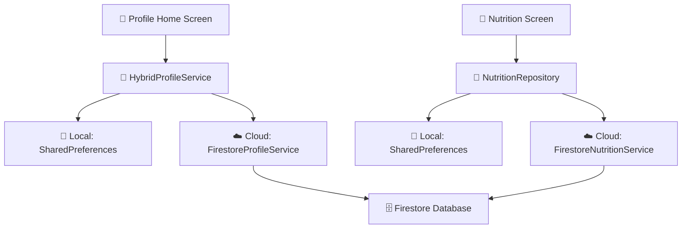
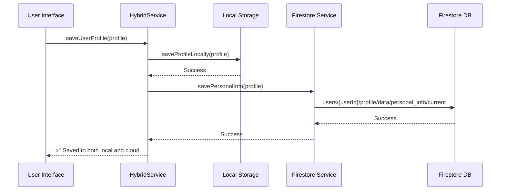
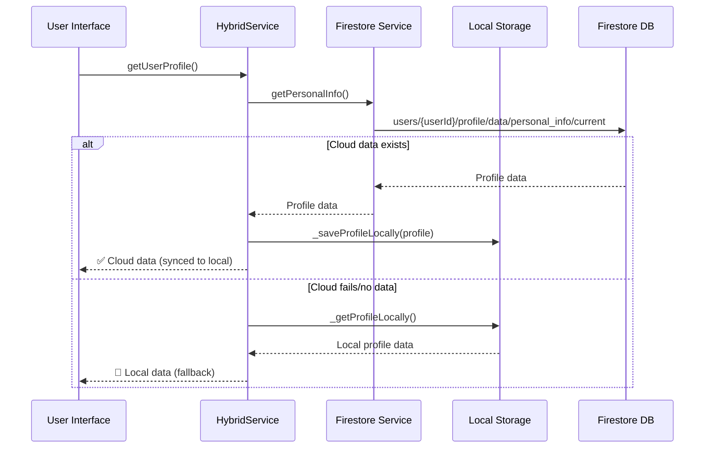

# 🏗️ Sustaina Health - Cloud Storage Architecture

## 📋 Overview

The Sustaina Health app implements a **modular, hierarchical Firestore structure** with a **hybrid storage strategy** (local + cloud) for optimal performance and offline capabilities. This document outlines the complete cloud storage architecture and data flow patterns.

## 🗂️ Firestore Database Structure

```
📁 Firestore Database: sustaina_health
│
└── 👥 users/
    │
    └── {userId}/ (authenticated user's UID)
        │
        ├── 🏋️ exercise/
        │   └── data/
        │       ├── workouts/
        │       │   └── {workoutId}/
        │       │       ├── id: string
        │       │       ├── name: string
        │       │       ├── exercises: array
        │       │       ├── duration: number
        │       │       ├── createdAt: timestamp
        │       │       └── updatedAt: timestamp
        │       │
        │       ├── exercise_history/
        │       └── fitness_goals/
        │
        ├── 🍎 nutrition/
        │   └── data/
        │       ├── food_log_entries/
        │       │   └── {entryId}/
        │       │       ├── id: string
        │       │       ├── userId: string
        │       │       ├── foodName: string
        │       │       ├── mealType: string (breakfast/lunch/dinner/snack)
        │       │       ├── servingSize: string
        │       │       ├── nutritionInfo: object
        │       │       │   ├── calories: number
        │       │       │   ├── protein: number
        │       │       │   ├── carbs: number
        │       │       │   ├── fat: number
        │       │       │   ├── fiber: number
        │       │       │   └── sugar: number
        │       │       ├── sustainabilityScore: string
        │       │       ├── notes: string
        │       │       ├── loggedAt: timestamp
        │       │       ├── imageUrl: string
        │       │       └── updatedAt: timestamp
        │       │
        │       ├── meal_plans/
        │       │   └── {planId}/
        │       │       ├── name: string
        │       │       ├── description: string
        │       │       ├── meals: array
        │       │       ├── totalCalories: number
        │       │       ├── createdAt: timestamp
        │       │       └── updatedAt: timestamp
        │       │
        │       ├── nutrition_goals/
        │       └── nutrition_insights/
        │
        ├── 👤 profile/
        │   └── data/
        │       ├── personal_info/
        │       │   └── current/
        │       │       ├── weight: double (kg)
        │       │       ├── height: int (cm)
        │       │       ├── age: int (years)
        │       │       ├── sex: string (Male/Female/Other)
        │       │       ├── fitnessGoal: string
        │       │       ├── workoutsPerWeek: int
        │       │       ├── availableEquipment: array[string]
        │       │       ├── activityLevel: string
        │       │       └── updatedAt: timestamp
        │       │
        │       ├── health_goals/
        │       │   └── {goalId}/
        │       │       ├── type: string
        │       │       ├── target: number
        │       │       ├── current: number
        │       │       ├── deadline: timestamp
        │       │       ├── createdAt: timestamp
        │       │       └── updatedAt: timestamp
        │       │
        │       ├── preferences/
        │       │   └── {prefId}/
        │       │       ├── category: string
        │       │       ├── settings: object
        │       │       ├── createdAt: timestamp
        │       │       └── updatedAt: timestamp
        │       │
        │       └── achievements/
        │           └── {achievementId}/
        │               ├── type: string
        │               ├── title: string
        │               ├── description: string
        │               ├── earnedAt: timestamp
        │               └── createdAt: timestamp
        │
        └── 😴 sleep/
            └── data/
                ├── sleep_records/
                │   └── {recordId}/
                │       ├── bedTime: timestamp
                │       ├── wakeTime: timestamp
                │       ├── duration: number
                │       ├── quality: number
                │       ├── createdAt: timestamp
                │       └── updatedAt: timestamp
                │
                ├── sleep_goals/
                └── sleep_insights/
```

## 🏛️ Architecture Components

### Service Layer Architecture



### Data Models

#### UserProfile Model
```dart
class UserProfile {
  final double? weight;              // Body weight in kg
  final int? height;                // Height in cm  
  final int? age;                   // Age in years
  final String? sex;                // Male/Female/Other
  final String? fitnessGoal;        // Weight loss, muscle gain, etc.
  final int? workoutsPerWeek;       // Exercise frequency per week
  final List<String> availableEquipment; // Home gym equipment list
  final String? activityLevel;      // Sedentary, lightly active, etc.
  
  // Conversion methods
  factory UserProfile.fromJson(Map<String, dynamic> json);
  Map<String, dynamic> toJson();
}
```

#### FoodLogEntry Model
```dart
class FoodLogEntry {
  final String id;                  // Unique identifier
  final String userId;              // User who logged the food
  final String foodName;            // Name of the food item
  final String mealType;            // breakfast/lunch/dinner/snack
  final String servingSize;         // Serving size description
  final NutritionInfo nutritionInfo; // Detailed nutrition data
  final String? sustainabilityScore; // Environmental impact score
  final String? notes;              // User notes
  final DateTime loggedAt;          // When the food was logged
  final String? imageUrl;           // Optional food image
}
```

### Service Responsibilities

| Service | Purpose | Storage Type | Key Methods |
|---------|---------|--------------|-------------|
| **FirestoreProfileService** | Pure cloud operations | Firestore only | `savePersonalInfo()`, `getPersonalInfo()` |
| **HybridProfileService** | Dual storage management | Local + Cloud | `saveUserProfile()`, `getUserProfile()` |
| **FirestoreNutritionService** | Nutrition cloud ops | Firestore only | `saveFoodLogEntry()`, `getFoodLogEntries()` |
| **NutritionRepositoryImpl** | Nutrition hybrid storage | Local + Cloud | Handles deduplication, sync |

## 🔄 Data Flow Architecture

### Save Operation Flow



### Load Operation Flow



## 📍 Storage Paths and Keys

### Firestore Collection Paths

| Module | Firestore Path | Purpose |
|--------|----------------|---------|
| **Profile** | `users/{userId}/profile/data/personal_info/current` | User's personal information |
| **Nutrition** | `users/{userId}/nutrition/data/food_log_entries/{entryId}` | Individual food log entries |
| **Nutrition** | `users/{userId}/nutrition/data/meal_plans/{planId}` | Saved meal plans |
| **Exercise** | `users/{userId}/exercise/data/workouts/{workoutId}` | Workout records |
| **Sleep** | `users/{userId}/sleep/data/sleep_records/{recordId}` | Sleep tracking data |

### Local Storage Keys

| Module | SharedPreferences Key | Purpose |
|--------|-----------------------|---------|
| **Profile** | `user_profile` | Serialized UserProfile JSON |
| **Profile** | `profile_weight`, `profile_height`, `profile_age`, `profile_sex` | Individual profile fields (legacy) |
| **Nutrition** | `food_log_entries` | Array of food log JSON strings |
| **Nutrition** | `meal_plans` | Array of meal plan JSON strings |

## ⚡ Key Features

### 1. Hybrid Storage Strategy

#### Benefits
- **📱 Local First**: Always save to SharedPreferences first for immediate access
- **☁️ Cloud Sync**: Automatically sync to Firestore when online
- **🔌 Offline Support**: App works without internet connection
- **🔄 Smart Fallback**: Uses local data if cloud fails

#### Implementation
```dart
Future<void> saveUserProfile(UserProfile profile) async {
  try {
    // Always save locally first
    await _saveProfileLocally(profile);
    
    // Save to cloud if user is signed in
    if (_isUserSignedIn) {
      try {
        await _firestoreService.ensureProfileModuleExists();
        await _firestoreService.savePersonalInfo(profile);
        print('✅ Saved to both local storage and Firestore cloud!');
      } catch (e) {
        print('Cloud save failed, but local save succeeded: $e');
      }
    }
  } catch (e) {
    throw Exception('Failed to save user profile: $e');
  }
}
```

### 2. Modular Design

#### Structure Benefits
- **🏗️ Isolated Modules**: Each feature has its own Firestore subcollection
- **📐 Consistent Structure**: All modules follow same `/data/` pattern
- **📈 Scalable**: Easy to add new features without affecting existing data
- **🔧 Maintainable**: Clear separation of concerns

#### Module Pattern
```
users/{userId}/{module}/data/{subcollection}/{documentId}
```

Examples:
- `users/abc123/profile/data/personal_info/current`
- `users/abc123/nutrition/data/food_log_entries/xyz789`
- `users/abc123/exercise/data/workouts/def456`

### 3. Data Integrity & Security

#### Timestamp Management
- **createdAt**: Server timestamp when document is first created
- **updatedAt**: Server timestamp on every update
- **loggedAt**: User-specific timestamps for time-sensitive data

#### Security Features
- **👤 User Isolation**: Each user's data is completely separate
- **🔐 Authentication Required**: All operations require valid Firebase Auth
- **🛡️ Type Safety**: Strong typing with Dart models
- **🚫 No Cross-User Access**: Firestore rules prevent access to other users' data

#### Error Handling
```dart
try {
  await _firestoreService.savePersonalInfo(profile);
  print('✅ Personal info saved to cloud storage');
} catch (e) {
  print('❌ Error saving to cloud: $e');
  // Graceful degradation - local storage still works
  await _saveProfileLocally(profile);
  print('📁 Saved to local storage (fallback)');
}
```

### 4. Deduplication & Performance

#### Nutrition Module Deduplication
- **30-second window**: Prevents duplicate food entries within 30 seconds
- **Unique key generation**: Based on food name, calories, and timestamp
- **Memory efficient**: Automatic cleanup of deduplication cache

```dart
// Create unique key for deduplication
final String dedupeKey = '${entry.foodName}_${entry.nutritionInfo.calories}_${entry.loggedAt.millisecondsSinceEpoch}';

// Check if recently saved
if (_recentlySaved.contains(dedupeKey)) {
  print('🔄 Skipping duplicate save for "${entry.foodName}" - already saved recently');
  return entry.id;
}
```

## 🚀 Recent Enhancements

### Personal Details Integration
- ✅ **Cloud Storage**: Personal details now save to Firestore
- ✅ **Auto-Sync**: Background sync on app startup  
- ✅ **Manual Sync**: User-triggered sync with loading states
- ✅ **Deduplication**: Prevents duplicate saves within 30 seconds
- ✅ **Error Recovery**: Graceful handling of network issues

### UI Improvements
- ✅ **Safe Dialogs**: Prevents black screen issues with proper context management
- ✅ **Loading States**: Visual feedback during sync operations
- ✅ **No Back Arrow**: Clean profile screen navigation
- ✅ **Success Feedback**: Toast messages for user actions

### Console Logging
- `✅ Personal info loaded from cloud storage` - Data loaded from Firestore
- `📁 Personal info loaded from local storage (fallback)` - Using local data
- `✅ Personal info saved to both local storage and Firestore cloud!` - Successful save
- `🔄 Successfully synced local personal data to cloud storage` - Manual sync worked
- `🔄 Skipping duplicate save` - Deduplication prevented duplicate entry

## 🔧 Technical Implementation

### Authentication Flow
```dart
String get _userId {
  final User? user = _auth.currentUser;
  if (user == null) {
    throw Exception('User not authenticated');
  }
  return user.uid;
}
```

### Module Initialization
```dart
Future<void> ensureProfileModuleExists() async {
  final DocumentReference profileDoc = _firestore
      .collection('users')
      .doc(_userId)
      .collection('profile')
      .doc('data');
  
  final DocumentSnapshot doc = await profileDoc.get();
  if (!doc.exists) {
    await profileDoc.set({
      'module': 'profile',
      'createdAt': FieldValue.serverTimestamp(),
      'lastUpdated': FieldValue.serverTimestamp(),
    });
  }
}
```

### Collection References
```dart
CollectionReference get _personalInfoCollection =>
    _firestore.collection('users')
             .doc(_userId)
             .collection('profile')
             .doc('data')
             .collection('personal_info');
```

## 📊 Benefits Summary

| Feature | Benefit | Implementation |
|---------|---------|----------------|
| **Hybrid Storage** | Offline capability + Cloud sync | Local + Firestore |
| **Modular Structure** | Scalable, maintainable code | Feature-based collections |
| **Type Safety** | Fewer runtime errors | Dart model classes |
| **Deduplication** | Prevents data pollution | In-memory cache with cleanup |
| **Error Handling** | Graceful degradation | Try-catch with fallbacks |
| **User Isolation** | Data privacy & security | User-scoped collections |
| **Real-time Sync** | Cross-device consistency | Firestore real-time updates |

This architecture ensures your personal details and all app data are **safely stored in the cloud**, **synchronized across devices**, and **always accessible offline**! 🎉

---

*Last updated: September 5, 2025*  
*Version: 2.0.0*  
*Author: Sustaina Health Development Team*
