# 🎨 Improved Architecture Diagram for Sustaina Health

## 🔍 Analysis of Your Current Diagram

Your current diagram shows a basic 3-tier architecture:
- **User** ↔ **Ghiraas App (Flutter)** ↔ **Backend (FastAPI + MCP server)** ↔ **Firebase**

This is a good foundation, but we can enhance it to better represent the complexity and sophistication of your Sustaina Health app.

---

## 🚀 Improvement Suggestions

### 1. **Add Feature Modules to Flutter App**

```mermaid
graph TB
    subgraph "👤 User Layer"
        USER[👤 User]
    end
    
    subgraph "📱 Sustaina Health Flutter App"
        subgraph "🏠 Core Features"
            HOME[🏠 Home Dashboard]
            MCP_CHAT[💬 MCP Command Chat]
        end
        
        subgraph "🎯 Health Features"
            AUTH[🔐 Authentication]
            EXERCISE[💪 Exercise & Workouts]
            NUTRITION[🍎 Nutrition Tracking]
            SLEEP[😴 Sleep Monitoring]
            PROFILE[👤 User Profile]
        end
        
        subgraph "⚙️ App Infrastructure"
            STATE[🔧 Riverpod State Management]
            ROUTER[🧭 GoRouter Navigation]
            STORAGE[💾 Hybrid Storage]
        end
    end
    
    subgraph "☁️ Backend Services"
        subgraph "🤖 AI Services"
            FASTAPI[⚡ FastAPI Backend]
            MCP_SERVER[🧠 MCP Server]
            AI_WORKOUT[💪 Workout AI]
            AI_NUTRITION[🍎 Nutrition AI]
        end
        
        subgraph "📊 Data & Storage"
            FIREBASE_AUTH[🔐 Firebase Auth]
            FIRESTORE[📄 Cloud Firestore]
            FIREBASE_STORAGE[📁 Firebase Storage]
        end
    end
    
    USER --> HOME
    HOME --> MCP_CHAT
    HOME --> EXERCISE
    HOME --> NUTRITION
    HOME --> SLEEP
    
    MCP_CHAT --> MCP_SERVER
    EXERCISE --> AI_WORKOUT
    NUTRITION --> AI_NUTRITION
    
    AUTH --> FIREBASE_AUTH
    STORAGE --> FIRESTORE
    PROFILE --> FIREBASE_STORAGE
```

### 2. **Enhanced Data Flow Architecture**

```mermaid
graph LR
    subgraph "📱 Mobile App Layer"
        UI[🎨 UI Components]
        PROVIDERS[🔧 Riverpod Providers]
        REPOS[📚 Repositories]
    end
    
    subgraph "🔄 Service Layer"
        LOCAL[💾 Local Storage]
        SYNC[🔄 Sync Service]
        API[🌐 API Services]
    end
    
    subgraph "☁️ Cloud Infrastructure"
        subgraph "🤖 AI Backend"
            FASTAPI[⚡ FastAPI]
            MCP[🧠 MCP Server]
            AI_MODELS[🤖 AI Models]
        end
        
        subgraph "📊 Firebase Platform"
            FIREBASE_AUTH[🔐 Auth]
            FIRESTORE[📄 Firestore]
            STORAGE[📁 Storage]
        end
    end
    
    UI --> PROVIDERS
    PROVIDERS --> REPOS
    REPOS --> LOCAL
    REPOS --> API
    API --> FASTAPI
    API --> FIREBASE_AUTH
    
    FASTAPI --> MCP
    MCP --> AI_MODELS
    
    SYNC --> FIRESTORE
    SYNC --> STORAGE
    
    LOCAL -.->|Background Sync| SYNC
```

### 3. **Detailed MCP Integration Flow**

```mermaid
sequenceDiagram
    participant User as 👤 User
    participant UI as 📱 Flutter UI
    participant Chat as 💬 MCP Chat Widget
    participant Speech as 🎤 Speech-to-Text
    participant MCP as 🧠 MCP Server
    participant AI as 🤖 AI Models
    participant Data as 📊 User Data
    
    User->>UI: Opens Home Dashboard
    UI->>Chat: Display MCP Chat FAB
    User->>Chat: Press & Hold Microphone
    Chat->>Speech: Start Recording
    Speech-->>Chat: Live Text Transcription
    User->>Chat: Release or Press Send
    Chat->>MCP: Send Command + Context
    MCP->>Data: Fetch User Health Data
    MCP->>AI: Process with AI Models
    AI-->>MCP: Generated Response
    MCP-->>Chat: Health Advice/Action
    Chat-->>UI: Update UI with Response
    UI-->>User: Display Results
```

### 4. **Technology Stack Visualization**

```mermaid
graph TB
    subgraph "🎨 Frontend Technologies"
        FLUTTER[📱 Flutter Framework]
        DART[🎯 Dart Language]
        RIVERPOD[🔧 Riverpod State Management]
        GOROUTER[🧭 GoRouter Navigation]
    end
    
    subgraph "🤖 Backend Technologies"
        FASTAPI_TECH[⚡ FastAPI Python]
        MCP_TECH[🧠 Model Context Protocol]
        AI_TECH[🤖 AI/ML Models]
        PYDANTIC[📋 Pydantic Validation]
    end
    
    subgraph "☁️ Cloud Services"
        FIREBASE_SUITE[🔥 Firebase Suite]
        FIRESTORE_DB[📄 Firestore NoSQL]
        FIREBASE_AUTH_SVC[🔐 Firebase Auth]
        FIREBASE_STORAGE_SVC[📁 Firebase Storage]
    end
    
    subgraph "💾 Storage Solutions"
        LOCAL_STORAGE[📱 Local Storage]
        SHARED_PREFS[🔧 SharedPreferences]
        HIVE_DB[📦 Hive Database]
        SQLITE_DB[🗃️ SQLite Database]
    end
    
    FLUTTER --> RIVERPOD
    FLUTTER --> GOROUTER
    FASTAPI_TECH --> MCP_TECH
    MCP_TECH --> AI_TECH
    
    FLUTTER -.->|API Calls| FASTAPI_TECH
    FLUTTER -.->|Auth & Data| FIREBASE_SUITE
    FLUTTER -.->|Local Cache| LOCAL_STORAGE
```

### 5. **Hybrid Storage Architecture**

```mermaid
graph TB
    subgraph "📱 App Layer"
        USER_ACTION[👤 User Action]
        UI_UPDATE[🎨 UI Update]
    end
    
    subgraph "🔄 Hybrid Storage Strategy"
        LOCAL_FIRST[💾 Local First]
        CLOUD_SYNC[☁️ Cloud Sync]
        OFFLINE_MODE[📴 Offline Mode]
    end
    
    subgraph "💾 Local Storage"
        IMMEDIATE[⚡ Immediate Response]
        SHARED_PREFS_LOCAL[🔧 SharedPreferences]
        HIVE_LOCAL[📦 Hive Database]
        SQLITE_LOCAL[🗃️ SQLite Cache]
    end
    
    subgraph "☁️ Cloud Storage"
        FIRESTORE_CLOUD[📄 Firestore Sync]
        FIREBASE_STORAGE_CLOUD[📁 Firebase Storage]
        BACKGROUND_SYNC[🔄 Background Sync]
    end
    
    USER_ACTION --> LOCAL_FIRST
    LOCAL_FIRST --> IMMEDIATE
    IMMEDIATE --> UI_UPDATE
    
    LOCAL_FIRST -.->|Background| CLOUD_SYNC
    CLOUD_SYNC --> FIRESTORE_CLOUD
    CLOUD_SYNC --> FIREBASE_STORAGE_CLOUD
    
    OFFLINE_MODE --> SHARED_PREFS_LOCAL
    OFFLINE_MODE --> HIVE_LOCAL
    OFFLINE_MODE --> SQLITE_LOCAL
```

---

## 🎯 Key Improvements Made

### 1. **Enhanced Granularity**
- **Before**: Simple 3-tier architecture
- **After**: Detailed feature breakdown showing all health modules

### 2. **Better Technology Representation**
- **Before**: Generic "Backend" label
- **After**: Specific technologies (FastAPI, MCP, Firebase services)

### 3. **User Experience Flow**
- **Before**: Basic user-app interaction
- **After**: Detailed UX flow including speech-to-text and MCP chat

### 4. **Data Strategy Visualization**
- **Before**: No storage strategy shown
- **After**: Hybrid local-first + cloud sync architecture

### 5. **Real Architecture Patterns**
- **Before**: Linear flow
- **After**: Clean Architecture with proper layer separation

---

## 📊 Recommended Diagram for Presentations

For your presentations, I recommend using the **Enhanced Data Flow Architecture** (#2 above) as it shows:

✅ **Clear separation of concerns**  
✅ **Technology stack visibility**  
✅ **Data flow patterns**  
✅ **Scalability considerations**  
✅ **Professional architecture design**

This will demonstrate to stakeholders that your app follows modern development practices and enterprise-level architecture patterns.

---

## 🔧 Tools for Creating Professional Diagrams

1. **Mermaid** (as used above) - Great for documentation
2. **Draw.io / Diagrams.net** - Professional diagramming tool
3. **Lucidchart** - Enterprise-grade architecture diagrams
4. **Figma** - For UI/UX focused architecture diagrams
5. **PlantUML** - Text-based diagram generation

Would you like me to help you create any specific diagram using these tools or export the Mermaid diagrams in a different format?
