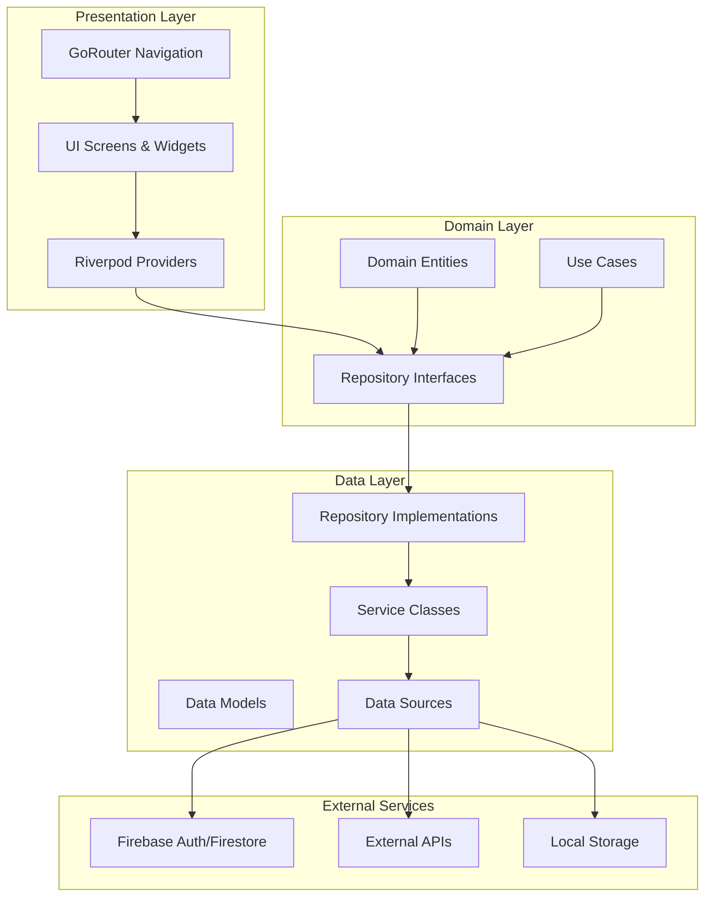
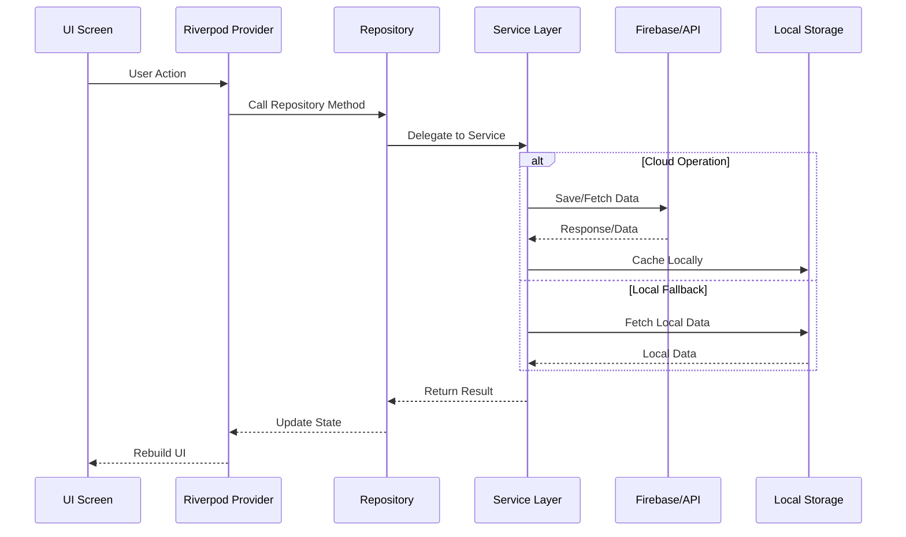
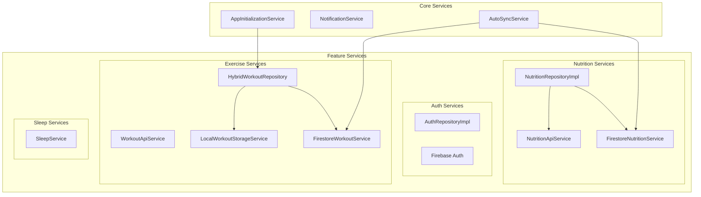
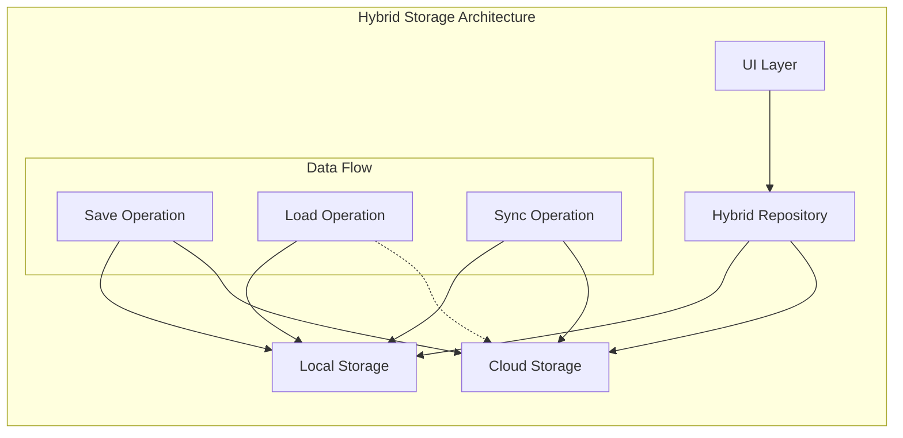
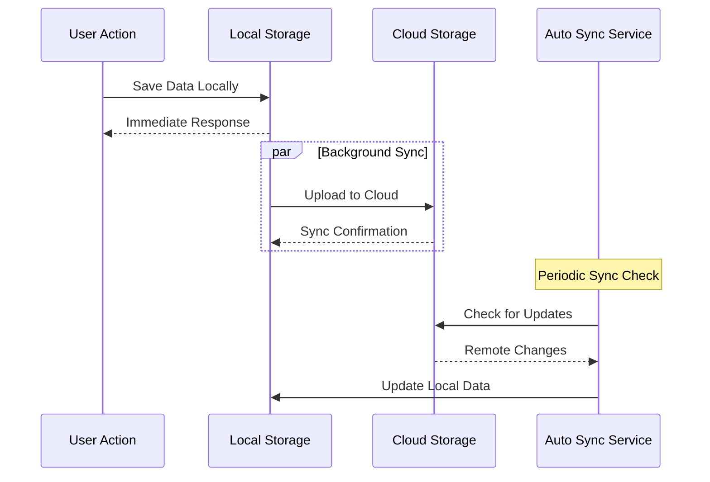
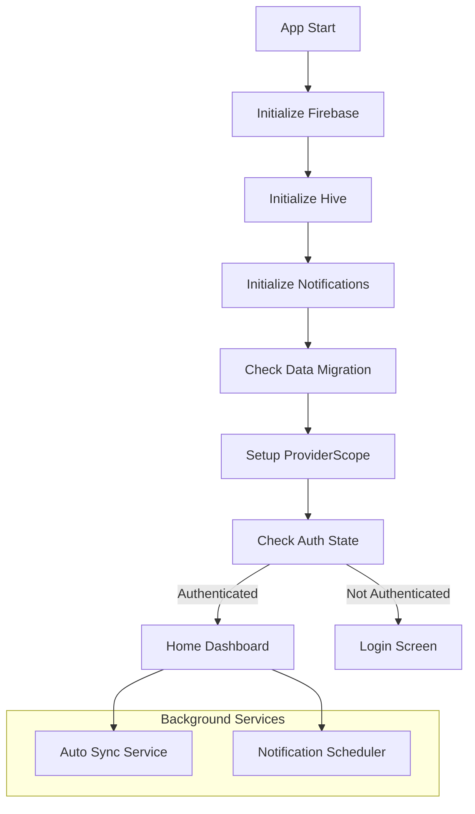

```mermaid
graph TB
    subgraph "lib/features/"
        subgraph "Auth Module"
            AUTH_P[presentation/]
            AUTH_D[domain/]
            AUTH_DATA[data/]
        end
        
        subgraph "Exercise Module"
            EX_P[presentation/]
            EX_D[domain/]
            EX_DATA[data/]
        end
        
        subgraph "Nutrition Module"
            NUT_P[presentation/]
            NUT_D[domain/]
            NUT_DATA[data/]
        end
        
        subgraph "Sleep Module"
            SLEEP_P[presentation/]
            SLEEP_D[domain/]
            SLEEP_DATA[data/]
        end
        
        subgraph "Home Module"
            HOME_P[presentation/]
            HOME_W[widgets/]
        end
        
        subgraph "Profile Module"
            PROF_P[presentation/]
            PROF_D[domain/]
            PROF_DATA[data/]
        end
    end
    
    subgraph "lib/core/"
        CORE_S[services/]
        CORE_P[providers/]
        CORE_W[widgets/]
        CORE_U[utils/]
    end
    
    AUTH_P --> CORE_S
    EX_P --> CORE_S
    NUT_P --> CORE_S
    SLEEP_P --> CORE_S
    HOME_P --> CORE_S
    PROF_P --> CORE_S
```

# 🏗️ Sustaina Health - Software Architecture Diagram

## 📋 Table of Contents
1. [Application Overview](#application-overview)
2. [High-Level Architecture](#high-level-architecture)
3. [Feature Module Architecture](#feature-module-architecture)
4. [Data Flow Diagram](#data-flow-diagram)
5. [State Management Architecture](#state-management-architecture)
6. [Service Layer Architecture](#service-layer-architecture)
7. [Navigation & Routing](#navigation--routing)
8. [Cloud Integration Architecture](#cloud-integration-architecture)

---

## 🔍 Application Overview

**Sustaina Health** is a comprehensive Flutter mobile application that combines health tracking with sustainability awareness. The app uses Clean Architecture principles with feature-based modularization and Riverpod for state management.

### 📱 Core Features
- **Authentication** - Firebase Auth with Google/Email login
- **Exercise** - AI workout generation, session tracking, hybrid storage
- **Nutrition** - AI meal analysis, food logging, meal planning
- **Sleep** - Sleep tracking, quality insights, trends analysis
- **Home Dashboard** - Centralized health overview with MCP command chat
- **Profile** - User profile management with cloud sync

---

## 🏛️ High-Level Architecture



---

## 🏗️ Feature Module Architecture



---

## 🔄 Data Flow Diagram



---

## 🔧 State Management Architecture

```mermaid
graph TB
    subgraph "Riverpod State Management"
        subgraph "Providers by Type"
            STATE_P[StateNotifierProvider]
            FUTURE_P[FutureProvider]
            STREAM_P[StreamProvider]
            BASIC_P[Provider]
        end
        
        subgraph "State Notifiers"
            AUTH_N[AuthNotifier]
            WORKOUT_N[WorkoutNotifier]
            NUTRITION_N[NutritionNotifier]
            SLEEP_N[SleepNotifier]
        end
        
        subgraph "Data States"
            LOADING[AsyncValue.loading()]
            DATA[AsyncValue.data(value)]
            ERROR[AsyncValue.error(error)]
        end
    end
    
    STATE_P --> AUTH_N
    STATE_P --> WORKOUT_N
    STATE_P --> NUTRITION_N
    STATE_P --> SLEEP_N
    
    AUTH_N --> LOADING
    AUTH_N --> DATA
    AUTH_N --> ERROR
    
    WORKOUT_N --> LOADING
    WORKOUT_N --> DATA
    WORKOUT_N --> ERROR
```

### Key Providers by Feature:

#### 🔐 Authentication Providers
- `authStateProvider` - Stream of auth state changes
- `currentUserProvider` - Current authenticated user
- `authRepositoryProvider` - Auth repository instance

#### 💪 Exercise Providers
- `workoutGenerationProvider` - AI workout generation
- `savedWorkoutPlansProvider` - Local workout storage
- `hybridWorkoutRepositoryProvider` - Hybrid cloud/local storage
- `workoutSessionProvider` - Active workout tracking

#### 🍎 Nutrition Providers
- `mealAnalysisProvider` - AI meal analysis
- `foodLogProvider` - Daily food logging
- `dailyNutritionSummaryProvider` - Daily nutrition aggregation
- `mealPlanGenerationProvider` - AI meal plan generation

#### 😴 Sleep Providers
- `sleepSessionsProvider` - Sleep session tracking
- `sleepStatsProvider` - Sleep statistics and trends
- `sleepInsightsProvider` - AI-generated sleep insights

---

## ⚙️ Service Layer Architecture



### 🔄 Hybrid Storage Pattern



---

## 🧭 Navigation & Routing

```mermaid
graph TB
    subgraph "GoRouter Configuration"
        ROOT[/ (Root)]
        AUTH_CHECK{Auth Check}
        
        subgraph "Authenticated Routes"
            HOME[/home - Home Dashboard]
            EXERCISE[/exercise - Exercise Hub]
            NUTRITION[/nutrition - Nutrition Hub]
            SLEEP[/sleep - Sleep Hub]
            PROFILE[/profile - User Profile]
        end
        
        subgraph "Auth Routes"
            LOGIN[/login - Login Screen]
            REGISTER[/register - Register Screen]
            FORGOT[/forgot-password - Password Reset]
        end
        
        subgraph "Feature Sub-Routes"
            WORKOUT_GEN[/exercise/generate - Generate Workout]
            MEAL_PLAN[/nutrition/meal-plan - Meal Planning]
            SLEEP_LOG[/sleep/log - Log Sleep Session]
        end
    end
    
    ROOT --> AUTH_CHECK
    AUTH_CHECK -->|Authenticated| HOME
    AUTH_CHECK -->|Not Authenticated| LOGIN
    
    HOME --> EXERCISE
    HOME --> NUTRITION
    HOME --> SLEEP
    HOME --> PROFILE
    
    EXERCISE --> WORKOUT_GEN
    NUTRITION --> MEAL_PLAN
    SLEEP --> SLEEP_LOG
```

### 🔒 Route Guards
- **Authentication Guard**: Redirects unauthenticated users to login
- **Profile Completion Guard**: Ensures user profile is complete for certain features
- **Feature Access Guard**: Controls access to premium features

---

## ☁️ Cloud Integration Architecture

```mermaid
graph TB
    subgraph "Firebase Services"
        FIREBASE_AUTH[Firebase Authentication]
        FIRESTORE[Cloud Firestore]
        FIREBASE_STORAGE[Firebase Storage]
        FIREBASE_MESSAGING[Firebase Messaging]
    end
    
    subgraph "External APIs"
        WORKOUT_API[Workout Generation API]
        NUTRITION_API[Nutrition Analysis API]
        MCP_API[MCP Command API]
    end
    
    subgraph "Local Storage"
        SHARED_PREFS[SharedPreferences]
        HIVE[Hive Database]
        SQLITE[SQLite (SQLflite)]
    end
    
    subgraph "App Features"
        AUTH_FEATURE[Auth Feature]
        EXERCISE_FEATURE[Exercise Feature]
        NUTRITION_FEATURE[Nutrition Feature]
        SLEEP_FEATURE[Sleep Feature]
        CHAT_FEATURE[MCP Chat Feature]
    end
    
    AUTH_FEATURE --> FIREBASE_AUTH
    
    EXERCISE_FEATURE --> FIRESTORE
    EXERCISE_FEATURE --> SHARED_PREFS
    EXERCISE_FEATURE --> WORKOUT_API
    
    NUTRITION_FEATURE --> FIRESTORE
    NUTRITION_FEATURE --> SHARED_PREFS
    NUTRITION_FEATURE --> NUTRITION_API
    
    SLEEP_FEATURE --> HIVE
    
    CHAT_FEATURE --> MCP_API
    CHAT_FEATURE --> SHARED_PREFS
```

### 📊 Data Synchronization Strategy



---

## 🎯 Key Architecture Patterns

### 1. **Clean Architecture**
- Clear separation of concerns across layers
- Domain layer contains business logic
- Infrastructure details isolated in data layer

### 2. **Feature-Based Modularization**
- Each feature is self-contained
- Shared code in core module
- Easy to maintain and scale

### 3. **Hybrid Storage Pattern**
- Local-first approach for performance
- Cloud sync for data persistence
- Offline capability with graceful fallbacks

### 4. **Reactive State Management**
- Riverpod for type-safe state management
- Automatic UI rebuilds on state changes
- Easy testing and debugging

### 5. **Repository Pattern**
- Abstraction layer over data sources
- Easy to mock for testing
- Consistent data access interface

---

## 🔧 Technology Stack

### **Frontend**
- **Flutter** - Cross-platform mobile framework
- **Dart** - Programming language
- **Riverpod** - State management solution
- **GoRouter** - Declarative routing

### **Backend Services**
- **Firebase Auth** - User authentication
- **Cloud Firestore** - NoSQL document database
- **Firebase Storage** - File storage
- **External APIs** - Workout/Nutrition generation

### **Local Storage**
- **SharedPreferences** - Simple key-value storage
- **Hive** - Lightweight, fast NoSQL database
- **SQLflite** - SQLite database wrapper

### **Development Tools**
- **Freezed** - Code generation for immutable classes
- **Json Annotation** - JSON serialization
- **Flutter Local Notifications** - Push notifications

---

## 📱 App Initialization Flow



---

This comprehensive architecture diagram provides a complete visualization of your Sustaina Health mobile app's structure, data flow, and component relationships. The app follows modern Flutter development practices with clean architecture, reactive state management, and robust cloud integration patterns.
