# 📐 Simple Software Architecture - Sustaina Health

## 🎯 Overview
This document contains simple, clean architecture diagrams for the Sustaina Health mobile application. These diagrams focus on clarity and are perfect for presentations and documentation.

---

## 📱 1. Simple System Architecture

```mermaid
graph TB
    %% Simple Software Architecture for Sustaina Health App
    
    subgraph "📱 Mobile App"
        USER[👤 User Interface]
        FEATURES[🎯 Health Features<br/>Exercise • Nutrition • Sleep<br/>Profile • MCP Chat]
        STATE[🔧 State Management<br/>Riverpod Providers]
    end
    
    subgraph "⚙️ Services Layer"
        LOCAL[💾 Local Storage<br/>Offline Data]
        API[🌐 API Services<br/>External Calls]
        SYNC[🔄 Sync Service<br/>Data Synchronization]
    end
    
    subgraph "☁️ Backend"
        FASTAPI[⚡ FastAPI<br/>AI Processing]
        MCP[🧠 MCP Server<br/>Command Processing]
        FIREBASE[🔥 Firebase<br/>Auth • Database • Storage]
    end
    
    %% Connections
    USER --> FEATURES
    FEATURES --> STATE
    STATE --> LOCAL
    STATE --> API
    STATE --> SYNC
    
    API --> FASTAPI
    API --> MCP
    SYNC --> FIREBASE
    LOCAL -.->|Background Sync| SYNC
    
    FASTAPI --> MCP
    
    %% Styling
    classDef mobileApp fill:#E3F2FD,stroke:#1976D2,stroke-width:2px
    classDef services fill:#F3E5F5,stroke:#7B1FA2,stroke-width:2px
    classDef backend fill:#E8F5E8,stroke:#388E3C,stroke-width:2px
    
    class USER,FEATURES,STATE mobileApp
    class LOCAL,API,SYNC services
    class FASTAPI,MCP,FIREBASE backend
```

**Key Components:**
- **Mobile App**: Flutter-based user interface with health tracking features
- **Services Layer**: Local storage, API communication, and data synchronization
- **Backend**: AI processing, command handling, and cloud storage

---

## 🔄 2. Simple Data Flow

```mermaid
graph LR
    %% Data Flow Architecture - Simple Version
    
    subgraph "📱 App"
        UI[UI Screen]
        PROVIDER[State Provider]
        REPO[Repository]
    end
    
    subgraph "💾 Storage"
        LOCAL[Local Cache]
        CLOUD[Cloud Storage]
    end
    
    subgraph "🤖 AI Services"
        API[External APIs]
        MCP[MCP Server]
    end
    
    %% Simple Flow
    UI --> PROVIDER
    PROVIDER --> REPO
    REPO --> LOCAL
    REPO --> API
    REPO --> CLOUD
    
    API --> MCP
    LOCAL -.->|Sync| CLOUD
    
    %% Styling
    classDef app fill:#FFE0B2,stroke:#F57C00,stroke-width:2px
    classDef storage fill:#E1F5FE,stroke:#0277BD,stroke-width:2px
    classDef ai fill:#F3E5F5,stroke:#7B1FA2,stroke-width:2px
    
    class UI,PROVIDER,REPO app
    class LOCAL,CLOUD storage
    class API,MCP ai
```

**Data Flow Pattern:**
1. **UI Screen** triggers user actions
2. **State Provider** manages application state
3. **Repository** handles data operations
4. **Storage** provides persistence (local + cloud)
5. **AI Services** process intelligent features

---

## 🏗️ 3. Feature-Based Architecture

```mermaid
graph TB
    %% Feature-Based Architecture - Simple View
    
    USER[👤 User]
    
    subgraph "📱 Sustaina Health App"
        HOME[🏠 Home Dashboard]
        
        subgraph "Health Features"
            AUTH[🔐 Authentication]
            EXERCISE[💪 Exercise]
            NUTRITION[🍎 Nutrition]
            SLEEP[😴 Sleep]
            PROFILE[👤 Profile]
            CHAT[💬 MCP Chat]
        end
        
        CORE[⚙️ Core Services]
    end
    
    subgraph "🌐 Backend Services"
        FIREBASE[🔥 Firebase]
        APIS[🤖 AI APIs]
    end
    
    %% Connections
    USER --> HOME
    HOME --> AUTH
    HOME --> EXERCISE
    HOME --> NUTRITION
    HOME --> SLEEP
    HOME --> PROFILE
    HOME --> CHAT
    
    AUTH --> CORE
    EXERCISE --> CORE
    NUTRITION --> CORE
    SLEEP --> CORE
    PROFILE --> CORE
    CHAT --> CORE
    
    CORE --> FIREBASE
    CORE --> APIS
    
    %% Styling
    classDef user fill:#FFCDD2,stroke:#D32F2F,stroke-width:3px
    classDef app fill:#E8F5E8,stroke:#4CAF50,stroke-width:2px
    classDef features fill:#E3F2FD,stroke:#2196F3,stroke-width:2px
    classDef backend fill:#FFF3E0,stroke:#FF9800,stroke-width:2px
    
    class USER user
    class HOME,CORE app
    class AUTH,EXERCISE,NUTRITION,SLEEP,PROFILE,CHAT features
    class FIREBASE,APIS backend
```

**Feature Modules:**
- **🔐 Authentication**: User login/registration
- **💪 Exercise**: Workout tracking and AI generation
- **🍎 Nutrition**: Meal logging and analysis
- **😴 Sleep**: Sleep monitoring and insights
- **👤 Profile**: User profile management
- **💬 MCP Chat**: AI command interface

---

## 🎨 Design Principles

### ✨ **Simplicity First**
- Clean, minimal design
- Easy to understand at first glance
- Perfect for stakeholder presentations

### 🎯 **Clear Separation**
- Distinct layers (Mobile, Services, Backend)
- Logical grouping of components
- Obvious data flow patterns

### 🚀 **Scalable Architecture**
- Modular feature design
- Separation of concerns
- Easy to extend and maintain

---

## 📊 Usage Recommendations

### For **Executive Presentations**:
Use the **Feature-Based Architecture** - shows business value and user features

### For **Technical Reviews**:
Use the **System Architecture** - demonstrates technical design and infrastructure

### For **Developer Onboarding**:
Use the **Data Flow** - explains how data moves through the system

### For **Marketing Materials**:
Use the **Feature-Based Architecture** with emphasis on user benefits

---

## 🔧 Export Options

These diagrams can be exported to:
- **PNG/JPG** - For presentations and documents
- **SVG** - For scalable graphics and web use
- **PDF** - For high-quality prints
- **Draw.io** - For further customization

---

This simple architecture documentation provides a clear, professional view of the Sustaina Health application structure while maintaining accessibility for both technical and non-technical audiences.
